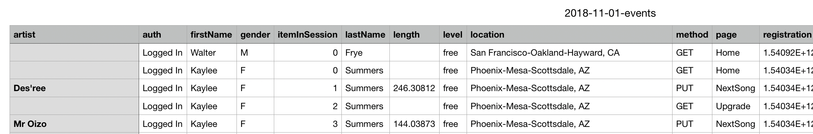

<h1>
  <center>Data modelling with Apache Cassandra</center>
</h1>

Author: Tianlin He

Date: 17 Aug 2020

Tag: #Udacity #Data Engineering #Apache Cassandra

# Project Overview

A startup called Sparkify wants to analyse the data they have been collecting on songs and user activity on their new music streaming app. They are particularly interested in understnading what songs users are listening to. They would like a data engineer to create an **Apache Cassandra database** that create queries on song play data to answer the three questions:

1. What are the artists, song titles and length of a song in the music app history that was hearted dueing a particular session;
2. What are the artists, song listened by a particular user in a particular session;
3. Who are the users, who listened to a particular song.

# Dataset

The data reside in a directory of CSV file (`event_data`) on user activity on the app. The first file lines of a file (`2018-11-01.csv`) looks like:



# Project Steps

The project is developed in a local enviornment (MacOS). 

## Local Installation on Mac on a single node

1. With `pip`, install `cql`

```zsh
$ pip install cql
```

2. With `Homebrew`, install `cassandra`

```zsh
$ brew install cassandra
```

3. Start  `cassandra` and connect to a single node, which is the default localhost

```zsh
$ brew services start cassandra
$ cassandra
cqlsh
Connected to Test Cluster at 127.0.0.1:9042.
[cqlsh 5.0.1 | Cassandra 3.11.7 | CQL spec 3.4.4 | Native protocol v4]
Use HELP for help.
cqlsh> 
```

4. Stop `cassandra`

```zsh
$ brew services stop cassandra
```

Don't forget to download the python driver for cassndra and connect:

```zsh
$ pip install cassandra-driver
```

## Fetch Data

The data from csv files were filtered and getched into a single CSV file `event_datafile_new.csv` containing 6821 lines.

## ETL Pipeline

The ETL Pipeline was developed in the note book  `etl.ipynb`

1. Create a Cassandra cluster in the local machine and connect to it
2. Write Apache Cassandra `CREATE KEYSPACE` and  `SET KEYSPACE` statements
3. For each queries, create one table with proper  `PRIMARY KEY`
4. Load the data with `INSERT` statement for each of the tables
5. Test by running the `SELECT` statement with `WHERE` clause
6. Drop tables and close the connection

## Test 

### 1. Give me the artist, song title and song's length in the music app history that was heard during  sessionId = 338, and itemInSession  = 4

```sql
query1c="SELECT artist, song, length FROM session_library WHERE sessionId=338 AND itemInSession=4"
try:
    rows=session.execute(query1c)
except Exception as e:
    print (e)
for row in rows:
    print (row.artist, row.song, row.length)
```

```
Faithless Music Matters (Mark Knight Dub) 495.30731201171875
```

### 2. Give me only the following: name of artist, song (sorted by itemInSession) and user (first and last name) for userid = 10, sessionid = 182

```sql
query2c="SELECT artist, song, firstname, lastname FROM user_library WHERE userId=10 AND sessionId=182"
try:
    rows=session.execute(query2c)
except Exception as e:
    print (e)
for row in rows:
    print (row.artist, row.song, row.firstname, row.lastname)
```

```
Down To The Bone Keep On Keepin' On Sylvie Cruz
Three Drives Greece 2000 Sylvie Cruz
Sebastien Tellier Kilometer Sylvie Cruz
Lonnie Gordon Catch You Baby (Steve Pitron & Max Sanna Radio Edit) Sylvie Cruz
```


### 3. Give me every user name (first and last) in my music app history who listened to the song 'All Hands Against His Own'

```sql
query3c="SELECT firstName, lastName FROM song_library WHERE song='All Hands Against His Own'"
try:
    rows=session.execute(query3c)
except Exception as e:
    print (e)
for row in rows:
    print (row.firstname, row.lastname)
```

```
Jacqueline Lynch
Tegan Levine
Sara Johnson
```

